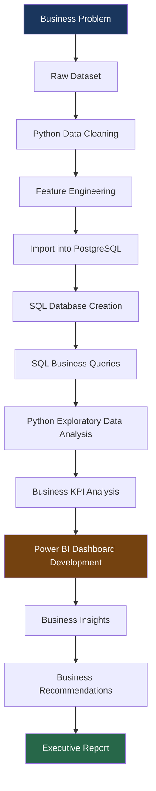
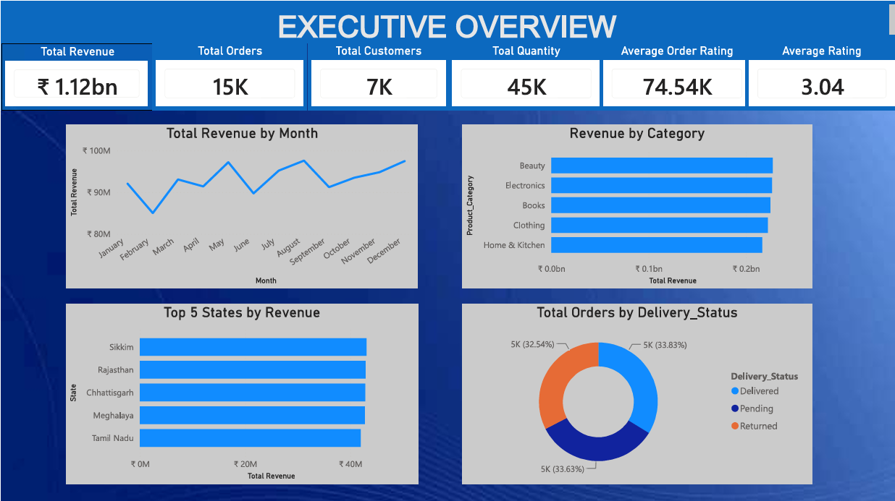

# E-Commerce Sales Performance Analytics | Python • SQL • PostgreSQL • Power BI • Excel

<!-- Project Banner -->
<!-- Uncomment when ready:  -->

<p align="center">


</p>

---

## Project Overview

In today's competitive e-commerce landscape, organizations generate vast volumes of transactional data daily — yet raw data alone does not drive business growth. **Actionable insights** do.

This project delivers a **complete end-to-end analytics solution** for an e-commerce sales platform, transforming **15,000 raw transactional records** into strategic business recommendations. The workflow spans the full modern data analytics lifecycle: from Python-based data cleaning and PostgreSQL database implementation, through SQL-driven business querying and exploratory analysis, to interactive Power BI dashboards and executive reporting.

| Dimension | Details |
|---|---|
| **Business Problem** | Lack of consolidated visibility into sales performance, customer behaviour, product demand, and operational efficiency |
| **Why Built** | To demonstrate real-world analytics capability — connecting data engineering, SQL analytics, and business intelligence into one cohesive deliverable |
| **Business Value** | Enables data-driven decisions on inventory, marketing, product quality, and customer experience |
| **Stakeholders** | Executive Leadership · Sales & Marketing Teams · Operations · Product Management · Finance |
| **Applicability** | Directly transferable to retail, D2C, marketplace, and omnichannel e-commerce environments |
| **Expected Outcomes** | Improved revenue visibility · Optimized product portfolio · Enhanced customer satisfaction · Reduced return rates · KPI-driven performance monitoring |

> **End-to-End Scope**
>
> This is not a standalone visualization exercise. It is a full analytics engagement — beginning with messy transactional data and ending with executive-ready insights, interactive dashboards, and strategic recommendations.

---

## Business Problem

E-commerce businesses must continuously answer critical performance questions to remain competitive. This project was designed to address the following:

| # | Business Question |
|---|---|
| 1 | Which products generate the **highest revenue**? |
| 2 | Which product **categories perform best**? |
| 3 | Which **customers contribute the most revenue**? |
| 4 | Which **states generate the highest sales**? |
| 5 | Which **payment methods** are preferred by customers? |
| 6 | Which products receive **poor customer feedback**? |
| 7 | Which **regions experience higher return rates**? |
| 8 | What **business decisions** can improve overall sales performance? |

Without a structured analytics pipeline, these questions remain unanswered — leading to reactive decision-making, missed revenue opportunities, and operational inefficiencies.

---

## Project Objectives

| Objective | Description |
|---|---|
| **Data Quality** | Clean, validate, and prepare raw transactional data for reliable analysis |
| **Database Architecture** | Import cleaned data into PostgreSQL and establish a query-ready analytical database |
| **SQL Analytics** | Execute business-oriented SQL queries to validate findings before visualization |
| **Exploratory Analysis** | Investigate sales trends, customer behaviour, and operational patterns using Python |
| **KPI Development** | Define and calculate core business metrics aligned with stakeholder needs |
| **Dashboard Design** | Build interactive Power BI dashboards for self-service executive reporting |
| **Business Reporting** | Deliver a comprehensive business report with actionable recommendations |
| **Documentation** | Maintain professional, recruiter-ready project documentation on GitHub |

---

## Dataset Information

| Attribute | Value |
|---|---|
| **Dataset Name** | E-Commerce Sales Transaction Data |
| **Total Records** | 15,000 |
| **Total Columns** | 14 |
| **Time Period** | January – December 2025 |
| **Currency** | INR (Indian Rupee) |
| **Geography** | India (Multi-State) |

### Dataset Features

| Column | Description |
|---|---|
| `Order_ID` | Unique identifier for each order |
| `Date` | Transaction date |
| `Customer_ID` | Unique customer identifier |
| `Product_Category` | Product category classification |
| `Product_Name` | Individual product name |
| `Quantity` | Units purchased per order |
| `Unit_Price_INR` | Price per unit in INR |
| `Total_Sales_INR` | Total order value in INR |
| `Payment_Method` | Payment channel used |
| `Delivery_Status` | Order fulfilment status |
| `Review_Rating` | Customer rating (1–5) |
| `Review_Text` | Customer review comment |
| `State` | Indian state of delivery |
| `Country` | Country of delivery |
| `Feedback` | Sentiment category (Positive / Neutral / Negative) |

> **Data Notes**
>
> - The **`Country`** column was removed during preprocessing as it contained only **one unique value** (India), providing no analytical variance.
> - The dataset was **highly balanced** with no major irregularities across products, categories, payment methods, or geographical regions — enabling fair comparative analysis.

---

## Technology Stack

| Category | Tools & Technologies | Purpose |
|---|---|---|
| **Programming** | Python 3.x | Data cleaning, EDA, database connectivity |
| **Data Manipulation** | Pandas, NumPy | Data wrangling, transformations, aggregations |
| **Visualization (Python)** | Matplotlib, Plotly | Exploratory charts and trend analysis |
| **Database** | PostgreSQL | Relational data storage and SQL analytics |
| **Query Language** | SQL | Business queries, aggregations, reporting |
| **Business Intelligence** | Power BI | Interactive dashboards and KPI monitoring |
| **Spreadsheets** | Microsoft Excel | Supplementary analysis and reporting |
| **Development** | VS Code, Jupyter Notebook | Development and notebook-based analysis |
| **Version Control** | GitHub | Project documentation and portfolio hosting |

---

## End-to-End Analytics Workflow



**Workflow Highlights:**

- **Python ↔ PostgreSQL Integration** — Python (`psycopg2` / SQLAlchemy) was used to establish the database connection, load the cleaned dataset, and execute queries programmatically.
- **SQL-First Analytics** — Business questions were validated using SQL queries on PostgreSQL **before** building visualizations, ensuring data accuracy and analytical rigour.
- **Iterative Validation** — Findings from SQL analysis were cross-verified with Python EDA before being incorporated into Power BI dashboards.

<details>
<summary><strong>Detailed Workflow Steps</strong></summary>

| Step | Activity | Tool |
|---|---|---|
| 1 | Define business questions and KPIs | Business Analysis |
| 2 | Ingest raw CSV transactional data | Python / Pandas |
| 3 | Clean, validate, and engineer features | Python / Pandas |
| 4 | Export cleaned dataset | CSV |
| 5 | Create PostgreSQL database and tables | PostgreSQL / Python |
| 6 | Execute analytical SQL queries | SQL |
| 7 | Perform exploratory data analysis | Python / Matplotlib / Plotly |
| 8 | Calculate business KPIs | Python / SQL |
| 9 | Design interactive dashboards | Power BI |
| 10 | Document insights and recommendations | PDF Report / GitHub |

</details>

---

## Database Implementation

The cleaned dataset was imported into **PostgreSQL** to create a production-style analytical database environment.

| Component | Implementation |
|---|---|
| **Database Engine** | PostgreSQL |
| **Connection** | Python (`psycopg2` / SQLAlchemy) |
| **Data Loading** | Bulk import of cleaned CSV into relational tables |
| **Query Execution** | Business-oriented SQL queries for analytical reporting |
| **Validation** | SQL results cross-verified against Python EDA outputs |

### SQL Techniques Applied

| Technique | Application |
|---|---|
| **Filtering & Sorting** | Isolate records by date, state, category, and delivery status |
| **Grouping & Aggregations** | Revenue totals, order counts, average ratings |
| **Joins** | Multi-table analytical queries (where applicable) |
| **Ranking** | Top-N products, states, and customers by revenue |
| **Window Functions** | Running totals, rank comparisons (where applicable) |
| **Business Reporting** | KPI summaries and operational performance reports |

> Business questions were **solved using SQL before visualization** — ensuring that every chart and KPI in the Power BI dashboard is backed by validated database queries.

---

## Data Preprocessing

Comprehensive data cleaning was performed in the **`dataPreprocessing.ipynb`** notebook to ensure analysis-ready data quality.

| Step | Action | Result |
|---|---|---|
| **Missing Values** | Inspected all 14 columns | No missing values detected |
| **Duplicate Records** | Checked `Order_ID` uniqueness | No duplicate records found |
| **Date Conversion** | Parsed `Date` column | Converted to datetime format |
| **Feature Engineering** | Extracted `Month` from `Date` | Enabled time-series analysis |
| **Country Removal** | Dropped single-value column | Removed redundant `Country` field |
| **Feedback Categories** | Mapped `Review_Rating` to sentiment | Created Positive / Neutral / Negative labels |
| **Data Validation** | Verified data types and ranges | All fields validated |
| **Export** | Saved cleaned dataset | `SalesData_cleaned.csv` ready for analysis |

<details>
<summary><strong>Feedback Category Logic</strong></summary>

| Review Rating | Feedback Category |
|---|---|
| 4 – 5 | Positive |
| 3 | Neutral |
| 1 – 2 | Negative |

This transformation enabled simplified sentiment analysis and product performance evaluation.

</details>

---

## Exploratory Data Analysis

Exploratory Data Analysis (EDA) was conducted in the **`EDA.ipynb`** notebook using Python to uncover patterns, trends, and anomalies across the full dataset.

### Analysis Dimensions

| Dimension | Key Investigations |
|---|---|
| **Sales Trends** | Monthly revenue patterns, seasonal fluctuations |
| **Category Performance** | Revenue and order volume by product category |
| **Product Demand** | Top and bottom performing products by revenue |
| **Customer Behaviour** | Purchase frequency, feedback sentiment distribution |
| **Regional Sales** | State-wise revenue and order distribution |
| **Payment Methods** | Revenue share by payment channel |
| **Delivery Performance** | Delivered vs. Pending vs. Returned order ratios |
| **Review Ratings** | Rating distribution and correlation with returns |
| **Return Behaviour** | Return rates by state, category, and product |
| **Business KPIs** | Total revenue, orders, customers, average order value |

---

## SQL Analysis

SQL queries were executed directly on the **PostgreSQL database** after importing the cleaned dataset. This phase validated all business hypotheses before dashboard development.

| Analysis Area | Business Questions Addressed |
|---|---|
| **Revenue Analysis** | Total revenue, revenue by period, average order value |
| **Sales Trends** | Monthly and quarterly sales performance |
| **Product Analysis** | Top/bottom products by revenue and quantity |
| **Category Analysis** | Category-wise revenue comparison and ranking |
| **Customer Analysis** | High-value customers, repeat purchase patterns |
| **State-wise Analysis** | Geographic revenue distribution across Indian states |
| **Payment Method Analysis** | Revenue and order share by payment channel |
| **Delivery Analysis** | Fulfilment status breakdown and operational metrics |
| **Customer Feedback Analysis** | Sentiment distribution and rating averages |
| **Returned Orders** | Return rates by product, category, and region |
| **Top Products** | Top 10 products by total revenue |
| **Top States** | Top 10 states by total revenue |
| **Business KPIs** | Executive-level metric calculations |

---

## Power BI Dashboard

An interactive **5-page Power BI dashboard** was developed to enable self-service analytics for business stakeholders. The dashboard leverages **KPI cards, slicers, drill-down visuals, and dynamic charts** for real-time exploration.

### Dashboard  — Executive Overview

> High-level KPIs, monthly revenue trends, category performance, top states, and delivery status distribution.

<p align="center">
  
</p>

<p align="center"><em>Figure 1: Executive Overview — Total Revenue INR 1.12B · 15K Orders · 7K Customers · Balanced Category & Regional Performance</em></p>

---

<details>
<summary><strong>Dashboard Features</strong></summary>

| Feature | Description |
|---|---|
| **KPI Cards** | Total Revenue, Orders, Customers, Quantity, Average Rating |
| **Interactive Slicers** | Filter by Date, Category, State, Payment Method, Delivery Status |
| **Drill-Down Visuals** | Navigate from category to product to order level |
| **Dynamic Charts** | Line, bar, donut, and matrix visuals with cross-filtering |
| **Conditional Formatting** | Visual cues for performance thresholds |
| **Mobile Layout** | Responsive design for on-the-go executive review |

</details>

---

## Key Business Insights

| # | Insight | Detail |
|---|---|---|
| 1 | **Balanced Revenue Distribution** | Revenue is evenly distributed across all 5 product categories (~INR 227M each) |
| 2 | **Balanced Customer Demand** | No single customer segment dominates — healthy, diversified demand |
| 3 | **Beauty — Top Category** | Beauty generated the highest revenue at **INR 227.5M**, marginally leading other categories |
| 4 | **Credit Card — Top Payment Method** | Credit Card transactions generated the highest revenue at **INR 286.9M** |
| 5 | **Hair Dryer — Highest Negative Feedback** | Hair Dryer received the most negative feedback (**260 negative reviews**), signalling a product quality concern |
| 6 | **No Major Operational Anomalies** | Delivery status split evenly: Delivered (33.8%), Pending (33.6%), Returned (32.5%) |
| 7 | **Balanced Geographical Performance** | Top states (Sikkim, Rajasthan, Chhattisgarh, Meghalaya, Tamil Nadu) show near-equal revenue (~INR 40M each) |
| 8 | **Balanced Payment Distribution** | Credit Card, Debit Card, UPI, Cash on Delivery, and Net Banking share revenue relatively evenly |
| 9 | **Ratings vs. Return Behaviour** | Customer review ratings showed **little correlation** with return behaviour — low-rated products were not necessarily returned more |
| 10 | **Healthy Operational Model** | The business demonstrates a **healthy and diversified operational model** with no critical single points of failure |

---

## Business Recommendations

| Area | Recommendation | Expected Impact |
|---|---|---|
| **Inventory Optimization** | Increase stock for Beauty category bestsellers; reduce slow-moving SKUs in underperforming lines | Improved stock turnover and reduced holding costs |
| **Product Quality Improvement** | Investigate Hair Dryer quality issues — highest negative feedback count; conduct root cause analysis | Reduced negative reviews and improved brand trust |
| **Customer Experience Enhancement** | Implement post-purchase follow-up for low-rated orders; personalize communication by feedback sentiment | Higher customer retention and satisfaction scores |
| **Regional Marketing** | Deploy targeted campaigns in high-revenue states (Sikkim, Rajasthan, Chhattisgarh) to capitalize on existing demand | Increased market share in proven regions |
| **Operational Improvements** | Address the ~33% pending delivery rate; optimize logistics and fulfilment workflows | Faster delivery times and improved customer satisfaction |
| **Return Reduction Strategies** | Analyze return patterns by product and state; improve product descriptions and quality checks | Lower return rates and reduced reverse logistics costs |
| **Payment Optimization** | Promote Credit Card and UPI incentives to shift customer preference toward lower-cost payment channels | Reduced transaction fees and improved margins |
| **Continuous KPI Monitoring** | Deploy automated Power BI refresh schedules and KPI alert thresholds | Real-time performance visibility for leadership |
| **Future Data Collection** | Capture profit margins, shipping costs, customer acquisition cost, and return reasons | Enable profitability and CLV analysis in future phases |

---

## Repository Structure

```
Ecommerce-Sales-Analysis/
|
|-- Data/
|   |-- SalesData.csv                  # Raw transactional dataset
|   +-- SalesData_cleaned.csv          # Cleaned & processed dataset
|
|-- sql/
|   +-- business_queries.sql           # SQL analytical queries
|
|-- notebooks/
|   |-- dataPreprocessing.ipynb        # Data cleaning & feature engineering
|   +-- EDA.ipynb                      # Exploratory data analysis
|
|-- src/
|   |-- dashboard.png                  # Executive Overview screenshot
|   +-- dashboard bg.jpg               # Project banner image
|
|-- images/                            # Additional dashboard captures
|
|-- Ecommerce-Sales-Analysis.pbix      # Power BI dashboard file
|-- Project Report.pdf                 # Detailed business report
|-- README.md                          # Project documentation
|-- requirements.txt                   # Python dependencies
|-- LICENSE                            # Project license
+-- .gitignore                         # Git ignore rules
```

---

## Skills Demonstrated

| Skill Category | Competencies |
|---|---|
| **Programming** | Python Programming, Pandas, NumPy |
| **Data Engineering** | Data Cleaning, Feature Engineering, Database Connectivity using Python |
| **Database & SQL** | SQL, PostgreSQL, Joins, Aggregations, Window Functions, Business Reporting Queries |
| **Analytics** | Exploratory Data Analysis, Business KPI Design, Statistical Investigation |
| **Business Intelligence** | Power BI, Dashboard Design, Interactive Visualizations |
| **Reporting** | Business Reporting, Data Storytelling, Executive Summary Writing |
| **Tools** | Excel, VS Code, Jupyter Notebook, GitHub |
| **Soft Skills** | Business Acumen, Stakeholder Communication, Problem Framing |

---

## Business Report

This repository includes a comprehensive deliverable package:

| Deliverable | Location | Description |
|---|---|---|
| **Detailed Business Report (PDF)** | `Project Report.pdf` | Full analytical findings and strategic recommendations |
| **Executive Summary** | Included in PDF Report | Leadership-ready summary of key insights |
| **Power BI Dashboard** | `Ecommerce-Sales-Analysis.pbix` | Interactive 5-page dashboard |
| **SQL Queries** | `sql/business_queries.sql` | Business-oriented PostgreSQL queries |
| **Python Notebooks** | `notebooks/` | Data preprocessing and EDA workflows |
| **Dashboard Screenshots** | `src/` | Visual captures of Power BI dashboards |

---

## Future Improvements

| Enhancement | Business Value |
|---|---|
| **Profit Analysis** | Move beyond revenue to margin-based decision making |
| **Customer Lifetime Value (CLV)** | Identify and retain high-value customers |
| **Demand Forecasting** | Predict product demand for inventory planning |
| **Sales Forecasting** | Project future revenue using time-series models |
| **Inventory Optimization** | ML-driven stock level recommendations |
| **Marketing Analytics** | Campaign ROI and channel attribution analysis |
| **Customer Segmentation** | RFM-based customer grouping for targeted marketing |
| **RFM Analysis** | Recency, Frequency, Monetary value scoring |
| **Recommendation System** | Product recommendation engine for cross-selling |
| **Machine Learning Models** | Churn prediction, return probability, sentiment NLP |

---

## Conclusion

This project demonstrates the **complete lifecycle of a modern Data Analyst** — from raw transactional data to strategic business recommendations.

The engagement follows a rigorous, industry-standard pipeline:

**Raw Data → Python Preprocessing → PostgreSQL Database → SQL Business Analytics → Exploratory Data Analysis → KPI Development → Interactive Power BI Dashboards → Business Reporting → Strategic Recommendations**

Rather than stopping at visualizations, this project focuses on **generating actionable business insights** that stakeholders can use to drive revenue growth, improve customer experience, optimize operations, and make informed strategic decisions.

It reflects the analytical rigour, technical breadth, and business communication skills expected of a Data Analyst, Business Intelligence Developer, or Analytics Consultant in a professional environment.

---

## Contact

<p align="center">

[](https://linkedin.com/in/your-profile)
[](https://github.com/your-username)
[](https://your-portfolio.com)
[](mailto:your.email@example.com)

</p>

<p align="center">
  <strong>SOHAM</strong> · Data Analyst · Business Intelligence Developer
</p>

<p align="center">
  <em>If you found this project insightful, consider giving it a star on GitHub!</em>
</p>

---

<p align="center">
  <sub>Built with Python · SQL · PostgreSQL · Power BI · Excel</sub>
</p>